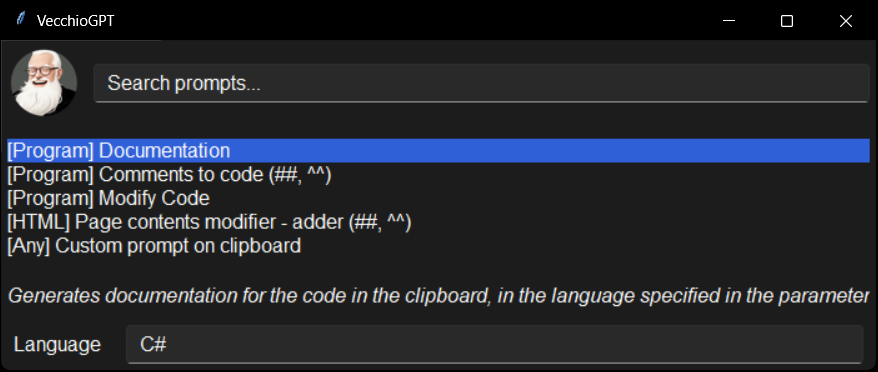

<div align="center">
  
</div>

# VecchioGPT

 _System-wide GPT prompts computed on your clipboard's contents! Ghe provo però vecchio bel casino vero? Sisi, si_

VecchioGPT is a Python application that allows users to apply custom GPT prompts to the text stored in the system clipboard. It is cross-platform and compatible with Windows, Linux and MacOS systems.

<br/><br/>
<div align="center">

</div>

## OpenAI API

VecchioGPT runs on the OpenAI API, which means that you need to have an OpenAI account and an [OpenAI API key](https://platform.openai.com/account/api-keys). Unlike the web version of ChatGPT Plus, which operates on a monthly subscription basis, API access is billed based on usage at very affordable prices, giving you access to all OpenAI models and tools.

The workflow is pretty easy: you can copy some text to your system clipboard, call a custom prompt using your clipboard contents as context, then the result will be copied to the clipboard, ready to be pasted anywhere.

## Features

Main features

- Clipboard Integration: Easily generate prompts which include the contents of your system clipboard.
- Customization: Easily create custom prompts to cover a wide range of use cases, using an extremely easy syntax.
- Sharing: Prompts are saved in JSON files which can be easily shared.
- Workflow Efficiency: Use a designated hotkey to call VecchioGPT, and the user-defined prompt is executed, with the output conveniently pasted into the clipboard.
- Interactive GUI: A cross-platform graphical user interface provides a user-friendly way to select and customize prompts.

Extras

- Voice command: Call a voice prompt with/without using your clipboard contents as context (using OpenAI Whisper)
- Read aloud: Speak the contents of your clipboard (using OpenAI TTS)

Use cases

- Easily modify your code using GPT. You can define your own workflow through system messages. For example, you can instruct a prompt to generate code from your comments
- Support your text writing process. Define some prompts which shorten text without losing informations, or turn a bad draft into well-written text.
- Summarize a long text.

## Installation

0. **Install [Python](https://www.python.org/downloads/) on your machine**. We developed VecchioGPT with Python 3.12, and we can't assure it will work on earlier versions.

1. **Clone the repository** (if you haven't done so already):
   
   ```bash
   git clone https://github.com/Neeqstock/VecchioGPT
   cd VecchioGPT
   ```

2. **Create a virtual environment** (optional but recommended):
   
   ```bash
   python -m venv venv
   ```
   
   Activate the virtual environment:
   
   - On Windows:
     
     ```bash
     venv\Scripts\activate
     ```
   
   - On macOS and Linux:
     
     ```bash
     source venv/bin/activate
     ```

3. **Install the required packages**:
   
   You can install all the necessary packages by running:
   
   ```bash
   pip install -r requirements.txt
   ```
   
   If you'd like to get Windows 11 notifications working (such option should be specified in the Settings.json file) you'll also need to install this dependency:
   
   ```bash
   pip3 install win11toaster
   ```

# 

## Usage

- Grab an OpenAI API key from [OpenAI API dashboard](https://platform.openai.com/api-keys). Add your OpenAI API key to the _Settings.json_ file:

```bash
OPENAI_API_KEY=<your-OpenAI-key>
```

- Copy some text using CTRL+C
- Open the VecchioGPT prompt selection GUI
  - Navigate using TAB/SHIFT+TAB and arrow keys
  - Select the prompt from the list and edit the additional parameters, if necessary
- Launch the prompt by pressing ENTER
- You will hear two sounds: the first to indicate the computation has started, the last to indicate the computation has ended
- Paste the result using CTRL+V
- Prompts, input and answers will also be printed on the console

There are two ways to call the prompt selection GUI:

**Method 1: single launch**

- Run gui.py:

```bash
python3 gui.py
```

**Method 2: background daemon with hotkeys**

- Run _daemon.py_ (you can reduce to icon the script console)
- Press the default keyboard shortcut assigned to call the prompt selection GUI

## Keyboard shortcuts

Keyboard shortcuts can be edited in the `shortcuts.json` file. Here's a list of the default shortcuts:

- CTRL + SHIFT + ALT + *: call the prompt selection GUI
- CTRL + SHIFT + ALT + .: stops audio playback or recording
- CTRL + SHIFT + ALT + -: switches to the next model
- CTRL + SHIFT + ALT + 1: records an audio and uses it as a request (using clipboard content as context)
- CTRL + SHIFT + ALT + 2: records an audio and uses it as a prompt (without using clipboard content as context)
- CTRL + SHIFT + ALT + 3: records an audio, transcribe, and simply put the text on clipboard
- CTRL + SHIFT + ALT + 4: reads the contents of the clipboard out loud
- CTRL + SHIFT + ALT + 9: calls the settings GUI
- F4: (while in the prompt selection GUI) edit the currently selected prompt
- F6: (while in the prompt selection GUI) create a new prompt, which will be named "example_prompt"

## Sample prompts

When you will clone VecchioGPT, the prompts folder will be almost empty. In the `Awesome-VecchioGPT` folder you will find a list of curated prompts which you can copy in the `prompts` folder.
You can take inspiration from these to create new ones!

## Models

Model names can be edited in the `gpt_models.json` file. Sometimes OpenAI adds new ones, you can add them in this list.

## Complexity

OpenAI released lots of different models with different context length, cost, and reasoning capacity. Since different prompts require different reasoning capacities, we implemented a way to define the required computational capacity for each prompt. Each prompt JSON file has a `complexity` field which can be set on three different values:

- `low` is for low-complexity computations, which require cheaper models with less reasoning power. If the complexity field is absent in the prompt JSON, this will be the default.
- `high` is for high-complexity computations, which require more expensive models with more reasoning power.
- `long` is for computation which require a high number of input and/or output tokens.

## Settings

In the `settings.json` file you will find some tweakable settings. You can also edit the settings through the settings editor GUI (which you can call through shortcuts, or by running directly `settingsGui.py`).

- `model`: indicates the currently selected model
- `OPENAI_API_KEY`: this needs to be set in order to run VecchioGPT
- `sound`: enables/disables sound notifications (e.g. on prompt completion). Can be set to `true` or `false`
- `popup`: enables/disables popup notifications. Can be set to
  - `off`, i.e. no popup notifications
  - `system`, i.e. popups handled by the OS
  - `vecchio`, i.e. popups handled by VecchioGPT's visual popup system
- `complexity-low_model`: defines which model will handle the low complexity prompts
- `complexity-high_model`: defines which model will handle the high complexity prompts
- `complexity-long_model`: defines which model will handle the long complexity prompts
- `speech-to-text_model`: defines which model will handle speech-to-text calls
- `text-to-speech_model`: defines which model will handle text-to-speech calls
- `text-to-speech_voice`: defines which text-to-speech voice will be used

On OpenAI websites you can find a list of [models](https://platform.openai.com/docs/models/continuous-model-upgrades) and [TTS voices](https://platform.openai.com/docs/guides/text-to-speech).

## Making new custom prompts

Creating new VecchioGPT prompts is very easy, through a very simple syntax. See the [prompt creation guide](./docs/prompt_creation_guide.md).
It's greatly advised not to create two prompts with the same _promptName_.
In the `templates` folder you will find a sample prompt file.

## Contribute

Feel free to contribute by forking the repository and creating pull requests. Bug reports and feature requests are welcome!

## Funny extras

- We programmed the core functionalities of VecchioGPT in an evening using ChatGPT. When these were ready, we programmed the rest using VecchioGPT itself.
- _Vecchio_ is a typical way to call a pal or a buddy in Veneto, an italian region.
